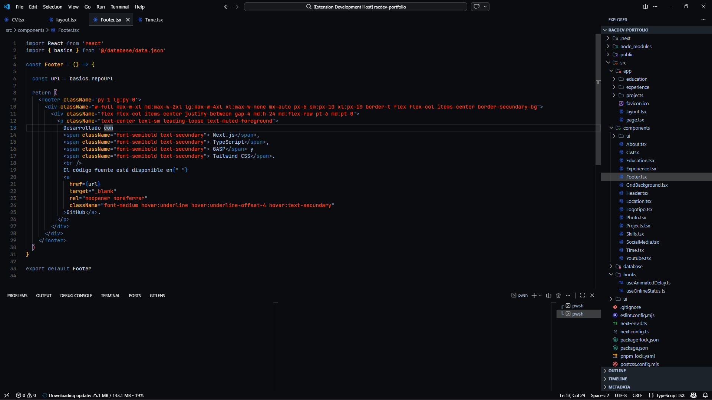

¡Claro\! Un buen archivo `README.md` es vital para que otros (y tú mismo en el futuro) entiendan qué hace especial a tu versión. He estructurado el contenido para resaltar que es una evolución estética del tema original de **bcomnes**, con un enfoque en el desarrollo moderno.

Aquí tienes una propuesta sólida y profesional:

-----

# Racdev Theme Tron 🌌

Una variante refinada y optimizada del clásico tema **Tron Legacy** para Visual Studio Code. Este tema está diseñado para desarrolladores que buscan una estética ciberpunk de alto contraste, inspirada en la Red, pero con ajustes específicos en la paleta de colores para mejorar la legibilidad en sesiones largas de programación.

> **Nota:** Este proyecto es un fork estético basado en el excelente trabajo de [bcomnes/tron-legacy-vscode](https://github.com/bcomnes/tron-legacy-vscode).

-----

## ✨ Características Principalas

  * **Contraste Optimizado:** Ajustes en los colores de realce (acentos neón) para que el código destaque sin cansar la vista.
  * **Sintaxis Vibrante:** Colores específicos para funciones, variables y operadores que respetan la jerarquía visual de la Red.
  * **Estética Minimalista:** Eliminación de ruido visual en la interfaz para un enfoque total en el editor.
  * **Compatibilidad:** Probado exhaustivamente en lenguajes como JavaScript, TypeScript, Python, HTML/CSS y Rust.

## 🚀 Instalación

1.  Abre **Visual Studio Code**.
2.  Ve a la vista de **Extensiones** (`Ctrl+Shift+X` o `Cmd+Shift+X`).
3.  Busca `racdev-theme-tron` (si ya lo publicaste) o instala el archivo `.vsix`.
4.  Haz clic en **Install**.
5.  Selecciona el tema en `File > Preferences > Theme > Color Theme` y busca **Racdev Theme Tron**.

## 📸 Capturas de Pantalla

| Vista del Editor | Paleta de Colores |

## 🤝 Créditos

Este tema no existiría sin la base de:

  * [Tron Legacy VS Code](https://github.com/bcomnes/tron-legacy-vscode) por **bcomnes**.
  * Inspiración visual de la película *TRON: Legacy*.

-----

**Desarrollado con ⚡ por rac-developer**